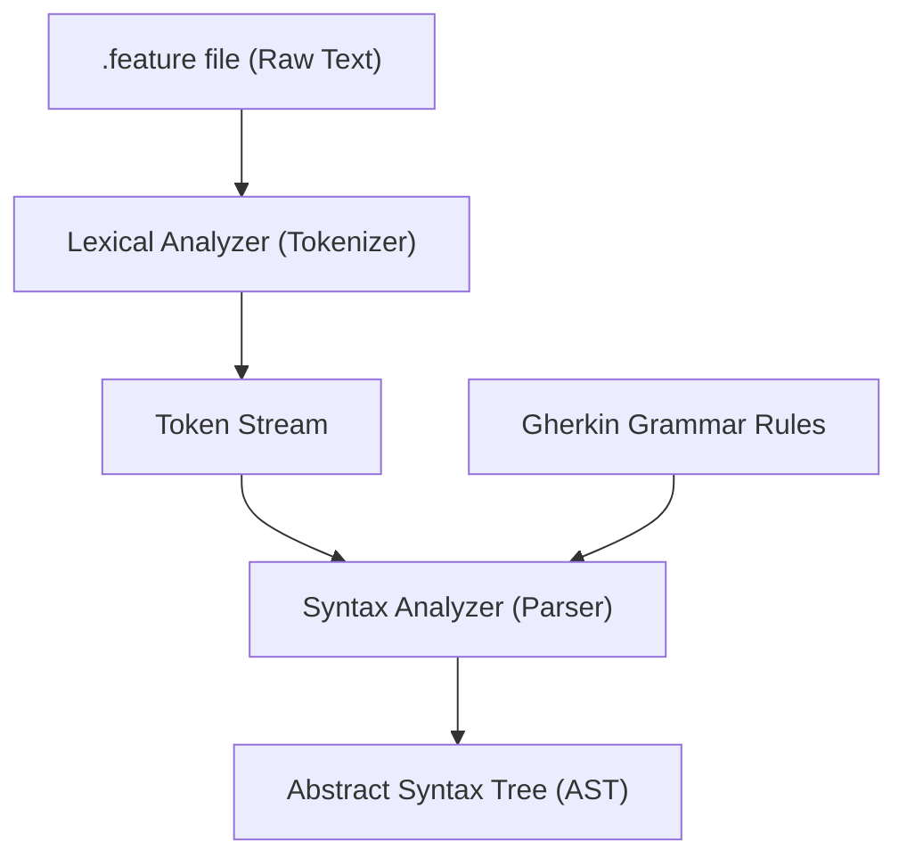

# Gherkin to Robot Framework Converter

Welcome to the Gherkin to Robot Framework Converter project! This tool is designed to help you bridge the gap between Gherkin's human-readable specifications and Robot Framework's powerful automation capabilities.

This project aims to parse Gherkin `.feature` files and automatically generate `.robot` files suitable for execution with Robot Framework.

## Gherkin and Cucumber

Gherkin is a Business Readable, Domain Specific Language (DSL) that lets you describe software’s behavior without detailing how that behavior is implemented. It is designed to be easy to understand by non-technical stakeholders.

Cucumber is a tool that executes Gherkin specifications. It reads Gherkin documents and runs the steps defined in them. These steps are typically written in a programming language like Python or Java.

The basic Gherkin syntax includes the following keywords:

*   `Feature`: Describes a software feature, and groups related scenarios.
*   `Scenario`: Describes a particular example of the feature's behavior.
*   `Given`: Describes the initial context or preconditions.
*   `When`: Describes an action or event.
*   `Then`: Describes the expected outcome or result.
*   `And`, `But`: Used to add more `Given`, `When`, or `Then` steps.

## Robot Framework

Robot Framework is a generic open-source automation framework. It can be used for test automation and robotic process automation (RPA). It has easy-to-use tabular syntax and it utilizes the keyword-driven testing approach. Its testing capabilities can be extended by test libraries implemented either with Python or Java.

Robot Framework's keyword-driven approach means that test cases are created using keywords, which are pre-defined or user-defined actions. This makes the tests easy to read and write, even for people who are not programmers.

Robot Framework can be used with Gherkin in a few ways:

*   **Converting Gherkin to Robot tests:** This is what this project aims to do. By converting Gherkin `.feature` files into `.robot` files, you can leverage Robot Framework's execution engine and reporting capabilities.
*   **Using libraries:** Some libraries allow Robot Framework to understand Gherkin syntax directly or provide a way to map Gherkin steps to Robot Framework keywords.

## Gherkin Language Parser Workflow

The following diagram illustrates the process of parsing Gherkin `.feature` files:



(Note: The original D2 source for a similar diagram is available in the `diagrams/gherkin_parser_workflow.d2` file.)

### Project's Gherkin Parser Implementation

This project utilizes a Gherkin parser, following the principles illustrated in the diagram above, to process `.feature` files. The core parsing logic can be found in `src/gherkbot/parser.py`. The Abstract Syntax Tree (AST) generated by this parser serves as the crucial structured data input for the `src/gherkbot/converter.py` module. This converter module is then responsible for transforming the Gherkin AST into executable Robot Framework test cases (`.robot` files).

## Features

- Parses Gherkin syntax from `.feature` files.
- Converts Gherkin scenarios into Robot Framework test cases.
- (Future) Maps Gherkin steps to Robot Framework keywords.

## Usage

The ultimate goal is to provide a command-line interface (CLI) tool for seamless conversion of Gherkin feature files to Robot Framework test files.

**Intended Usage (Under Development):**

```bash
python -m gherkbot.cli --input path/to/your/file.feature --output path/to/your/outputfile.robot
```

*   **Input:** Path to a Gherkin `.feature` file.
*   **Output:** Path to the generated Robot Framework `.robot` file.

Currently, the CLI and the full conversion logic are under active development. You can explore the existing parser and converter modules directly:
*   `src/gherkbot/parser.py`: Contains the Gherkin parsing logic.
*   `src/gherkbot/converter.py`: Contains the logic for converting the parsed Gherkin AST to Robot Framework format.
