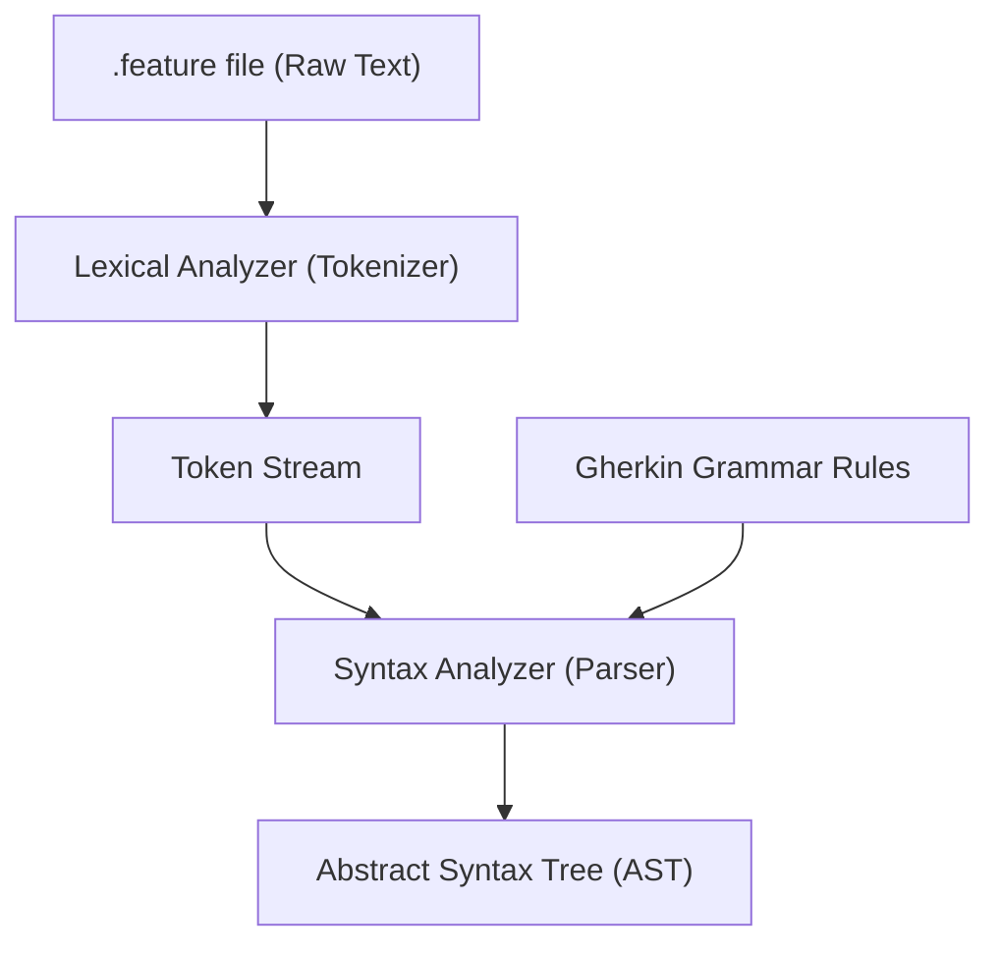

```mermaid
graph TD
    Input[".feature file (Raw Text)"] --> Lexer["Lexical Analyzer (Tokenizer)"]
    Lexer --> Tokens["Token Stream"]
    Tokens --> Parser["Syntax Analyzer (Parser)"]
    Grammar["Gherkin Grammar Rules"] --> Parser
    Parser --> AST["Abstract Syntax Tree (AST)"]
```
